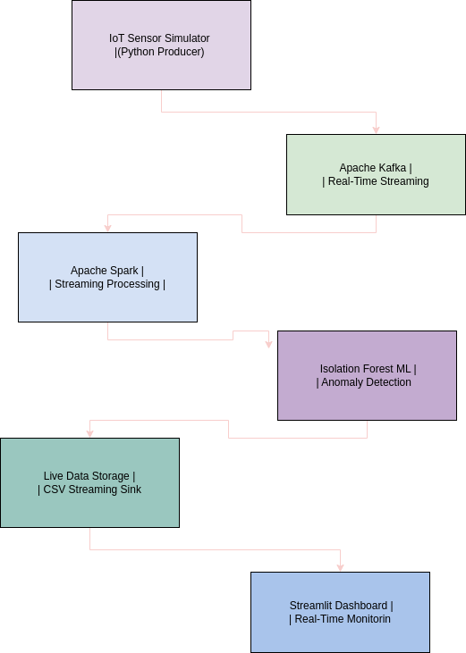
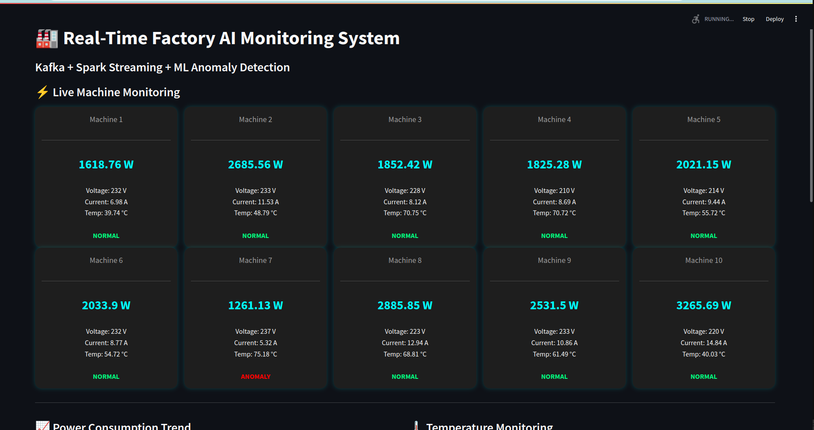
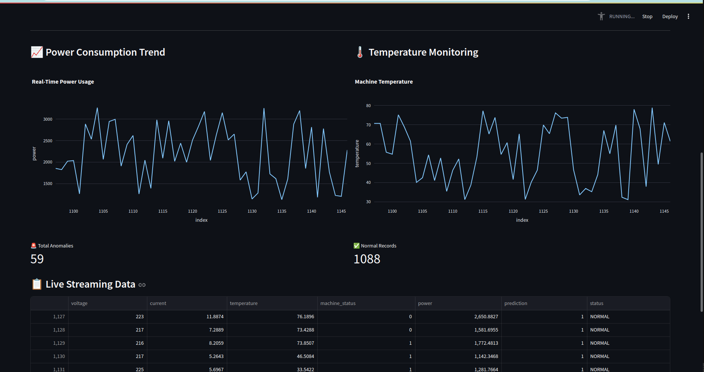
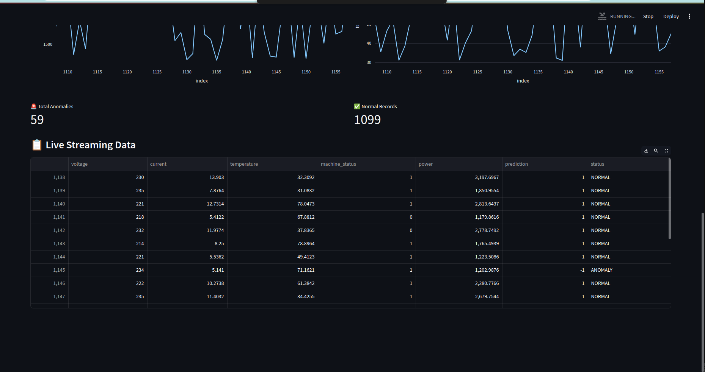
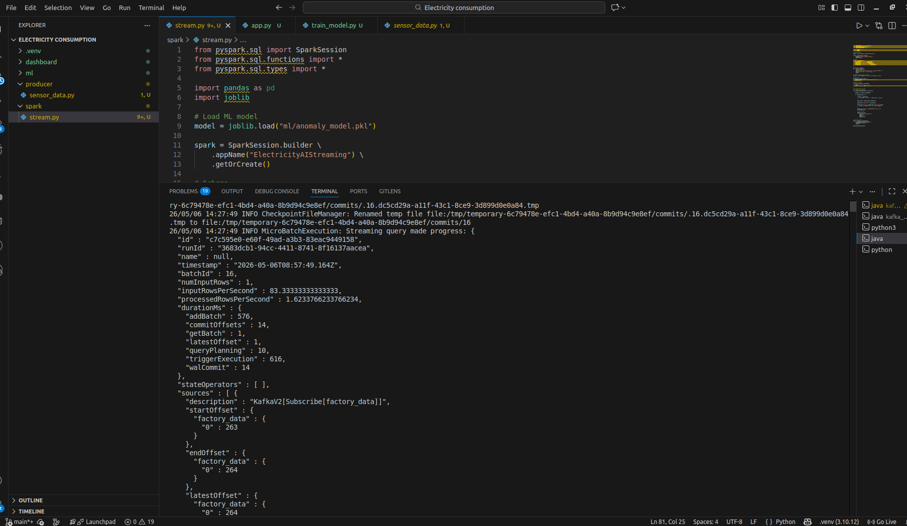
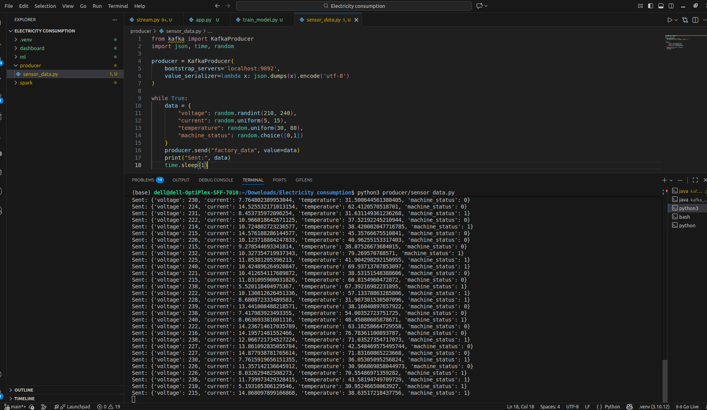

# Industrial IoT AI Energy Monitoring Platform

Real-time industrial energy monitoring platform using Kafka, Spark Streaming, Isolation Forest ML, and Streamlit dashboard for AI-based anomaly detection.

---

# 🚀 Project Overview

This project simulates a smart industrial factory monitoring system capable of processing real-time electricity sensor data using distributed streaming technologies and machine learning.

The platform continuously streams electricity consumption data from simulated IoT sensors, processes it using Apache Spark Streaming, detects anomalies using an Isolation Forest machine learning model, and visualizes everything in a live Streamlit dashboard.

The project demonstrates:
- Real-time streaming analytics
- Industrial IoT monitoring
- AI-based anomaly detection
- Spark Streaming pipelines
- Live dashboard visualization
- End-to-end data engineering workflow

---

# ⚡ Features

- Real-time Kafka streaming
- Apache Spark Streaming
- Isolation Forest anomaly detection
- AI-powered monitoring
- Live Streamlit dashboard
- Power consumption analysis
- Temperature monitoring
- Industrial IoT simulation
- Real-time anomaly alerts

---

# 🏗 Architecture Diagram



---

# 📸 Dashboard Preview

## Real-Time Factory Monitoring Dashboard





---

# 📡 Spark Streaming Predictions

## AI-Based Real-Time Predictions



---

# 🔌 Kafka Producer Streaming

## IoT Sensor Data Simulation



---

# 🛠 Tech Stack

| Category | Technology |
|---|---|
| Programming Language | Python |
| Streaming Platform | Apache Kafka |
| Stream Processing | Apache Spark Streaming |
| Machine Learning | Scikit-learn |
| ML Algorithm | Isolation Forest |
| Dashboard | Streamlit |
| Visualization | Plotly |
| Data Handling | Pandas |

---

# 📂 Project Structure

```bash
Industrial-IoT-AI-Energy-Monitoring-Platform/
│
├── dashboard/
│   └── app.py
│
├── ml/
│   ├── train_model.py
│   └── anomaly_model.pkl
│
├── producer/
│   └── sensor_data.py
│
├── spark/
│   └── stream.py
│
├── screenshots/
│   ├── architecture.png
│   ├── dashboard.png
│   ├── producer.png
│   └── spark_stream.png
│
├── requirements.txt
├── README.md
└── .gitignore
```

---

# ⚙️ Installation

## Clone Repository

```bash
git clone YOUR_GITHUB_REPO_LINK
```

---

## Move Into Project

```bash
cd Industrial-IoT-AI-Energy-Monitoring-Platform
```

---

## Install Dependencies

```bash
pip install -r requirements.txt
```

---

# ▶️ Running the Project

## Step 1 — Start Zookeeper

```bash
cd kafka_2.13-3.6.1
bin/zookeeper-server-start.sh config/zookeeper.properties
```

---

## Step 2 — Start Kafka Server

```bash
cd kafka_2.13-3.6.1
bin/kafka-server-start.sh config/server.properties
```

---

## Step 3 — Run Producer

```bash
python3 producer/sensor_data.py
```

---

## Step 4 — Run Spark Streaming

```bash
spark-submit \
--packages org.apache.spark:spark-sql-kafka-0-10_2.12:3.5.1 \
spark/stream.py
```

---

## Step 5 — Run Dashboard

```bash
streamlit run dashboard/app.py
```

---

# 🤖 Machine Learning

The project uses Isolation Forest for:

- anomaly detection
- abnormal electricity consumption detection
- industrial monitoring analytics

Prediction Labels:

| Prediction | Meaning |
|------------|---------|
| 1          | Normal |
| -1         | Anomaly |

---

# 📊 Real-Time Monitoring Metrics

The dashboard monitors:

- Voltage
- Current
- Temperature
- Power Consumption
- Machine Status
- AI Anomaly Prediction

---

# 🚀 Future Improvements

- Docker deployment
- AWS deployment
- PostgreSQL integration
- Grafana monitoring
- Email/SMS alerts
- Kubernetes deployment
- Real IoT device integration

---

# 👨‍💻 Author

Ajanya M
mkl.ajanya@gmail.com

# ⭐ If you like this project

Give it a star on GitHub ⭐